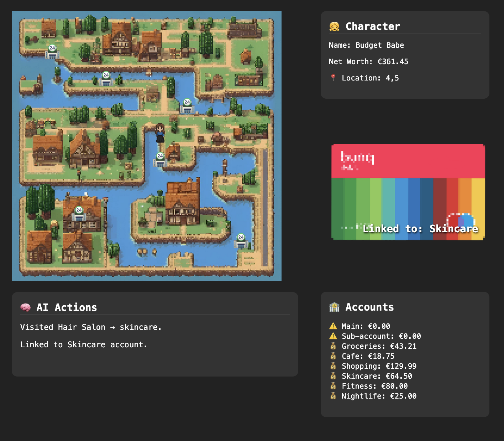

# 🌍 GeoCard – The AI-Powered Smart Debit Card

Welcome to **GeoCard**, a playful experiment in AI-driven bank cards.
This project simulates a debit card that intelligently switches your linked Bunq account in real time based on **your location, behavior, and time of day** — no manual input required.
Made by Francesca!

## 🖼️ Live Demo Preview

Try it out in **GeoCard AI Town**!

> 💬 *“This time, her card didn’t just work — it was ready.”*



---

## 👩‍🦰 Meet BudgetBabe

She's the star of GeoCard AI Town — walking around town, visiting cafés and shops, and letting her card think for her.


---

## 🚀 Features

- 📍 **Geo-aware intelligence**  
  Uses mock GPS coordinates to track real-time location.

- 🧠 **Contextual AI decision engine**  
  Predicts which bank account to use based on time, place, and past behavior.

- 🔁 **Automatic account switching**  
  Integrates with the [Bunq API](https://doc.bunq.com/) to change the monetary account linked to your debit card.

- 🔔 **Live notification system**  
  Displays in-game updates that reflect account changes instantly.

- 🎨 **Retro-style pixel town UI**  
  Fully interactive 2D grid built for demo immersion.

---

## 🛠️ Technologies

- React / Next.js (frontend)
- Tailwind CSS (UI)
- Zustand or Redux (state management)
- DALL·E + Pixel sprites (character art)
- Claude / OpenAI / NVIDIA AI APIs (AI logic)
- Bunq API (account switching logic)
- Geolocation & time simulation (for demo)

---

## 🧪 Try It Out

To run locally:

```bash
git clone https://github.com/yourusername/geocard.git
cd geocard
npm install
npm run dev
